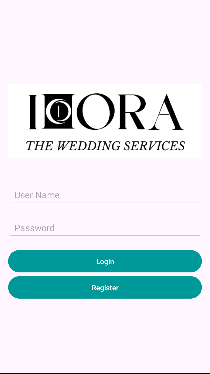

# ihora Wedding Services App

**ihora** is an Android application built using Kotlin. The app provides wedding services through a user-friendly platform where users can explore services, learn more about them, and easily navigate different sections of the app. This app includes features like user login, registration, and social media integration.

## Features
- **Language Selection:** Users can select their preferred language.
- **Login and Registration:** Secure login and registration with username and password. Users can also reset forgotten passwords.
- **Home Page:** A scrollable home page.
- **Menu Navigation:** Sub-items like Home, About, Services, and Blog.

## Screenshots
Here are some screenshots from the app:

### Login Screen


### Home Screen


## Tech Stack
- **Kotlin** for Android development
- **Android Studio** for building and testing the app

## Installation
To set up the project locally:
1. Clone the repository:
   ```bash
   git clone https://github.com/yourusername/ihora.git
2. Open the project in Android Studio.
3. Sync Gradle and build the project.
4. Run the app on an emulator or physical device.


